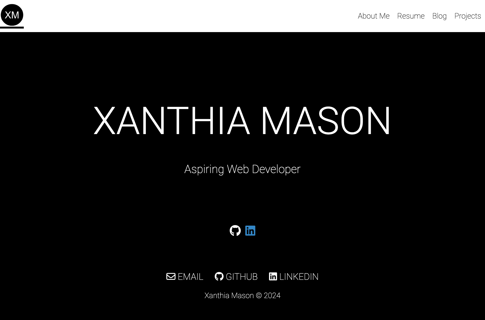
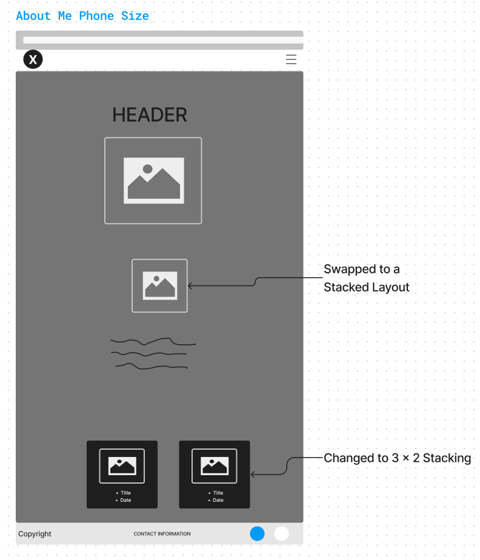

# T1A2_Portfolio

Xanthia Mason

## GitHub Repository

[Link to my GitHub Repo](https://github.com/xanni99/T1A2_Portfolio)

## Purpose

The purpose of this Portfolio was to create a website that not only provides information about myself, my interests and my work experience, but also highlights my proffesional knowledge, talent and abilities.

### Target Audience

The target audience for this portfolio is employers looking to engage a Software Developer. As a result, it is hoped that my Portfolio is able to highlight neccesary information with professionalism, while also allowing any prospective employers to easily get in contact, if they like what they see.

### Tech Stack

The tech stack used for the creation of this portfolio was HTML and CSS.  HTML was utilised to create the basic structure of the websites and each page within it; and CSS was utilised to style each of the pages in order to meet the goal of the website.

Additionally, Figma was used twice during the planning stages of the Portfolio.

1. Firstly, to create wireframes of each intended HTML page, and how they should each look on different screen sizes.
2. And secondly, to create a sitemap of all the pages on the website and give an overview of how it can be navigated.

Finally, GitHub was used for source control throughout the entire project.

## Sitemap

As you can see from the sitemap above, the Portfolio has a homepage and 4 additional pages. Each of these four pages can be accessed by clicking a link on the hompage (represented above as the black lines). Likewise, the homepage can be accessed through each of the 4 pages by clicking a link on each of the 4 pages (also represented through the black lines). Additionally, each of the 4 HTML pages can be accessed by clicking a link on the Nav bar that is located on each page. This can be seen on the sitemap above, as each HTML page has 3 red lines running into it, meaning it can be accessed by any of the other 3 pages. Overall, both the black and red lines represent the Nav Bar that is uniform accross all of the pages. I chose to make the Nav Bar availble on all of the pages to ensure easy movement from page to page in addition to allowing the viewers to go back and forth between pages if desired. All of these (black and red) links (when clicked), open up in the current page. This was preferable over opening each page in a new tab as it allows for a more seamless and cohesive viewing of the Portfolio.

It can also be seen from the sitemap above, that each page (homepage + 4 pages) has 3 contact links (to Email, Linkdin and Github) which can be observed above as the green circles. These represent the links provided in the footer of each document. I chose to put these 3 links in the footer (and therefore have them available on each page), as the target audience for this Portfolio is prospective employers and therefore, I wanted to make sure they have easy access to contact me from any page. All of these links, (when clicked) open up in new tabs instead of opening in the current page as it is intended that these links provide additional information/contact opportunities without intterupting their ability to view the rest of the Portfolio.

The Homepage has 2 additional links that take the viewer to my professional accounts, Linkdin and GitHub (can be seen above in the pink circles). Although these links can already be accessed through the footer of this page, they add to the simplistic styling of the homepage (that will be explained in further detail below) in addition to driving home the message that this is a proffessional Portfolio.

It can also be seen from the sitemap above that there is a link to the Blog page on the About Me page. This is because snippets from the blog page are highlighted in the About Me page, and as a result, I wanted the viewer to have easy access to the blog page (which provides more information) from the about me page.

Finally, it can be seen in the sitemap above that there is an external link to a PDF copy of my Resume that can be accessed from the Resume page. This was an aesthetic decision that will be explained in further detail below, but ultimately, allows quick access to a PDF copy of my resume without it taking up space on the webpage. Again, since the target audience of this Portfolio is prospective employers, this link opens up in a new tab so that they have the option to read it in futher detail after exploring the rest of my Portfoloio.

## Homepage

### Wireframes and Portfolio Screenshots of Homepage

Screenshot of Homepage - Desktop View

Screenshot of Homepage - Tablet View

Screenshot of Homepage - Phone View

### Decision Making Process of the Homepage

For the homepage, I wanted this do be as minimal as possible. My decision behind this was that I wanted my name to stand out and not have too much visual clutter surrounding it, so that it would hopefully make an impact to the employer. As a result, the hero unit included my name only and a very brief description of 'Aspiring Developer', getting the message across that my intention for the creation of this website is to highlight my skills as it is my goal to become a developer. Additionally, I decided to include 2 icons that linked to my professional accounts (GitHub and LinkedIn), again to really drive home the message that this website is to show that I am an Aspiring Developer, willing to be contacted by potential employers.

The styling for the homepage was used to enhance the simplistic and professional look I was after. A black background with white writing was chosen for the homepage, to make it stand out and make more of an impact than the other pages. A simple font was chosen that can be easily read, and it was centered for maximum impact and readability. Additionally, only a very minimal number of colours are used throughout the entire website to continue the professional feel. I did keep the LinkedIn icon blue as it does provide some relief of the black and white homepage, in addition to drawing the viewers attention to click on the icon, which will take them to my professional account.

The Nav Bar is consistent accross all pages as I wanted it to be a seamless experience for the viewer. It consists of a Logo of my initials, which again I created with simplicity and professionalism in mind, in addition to links to the other 4 HTML pages, which are evenly spaced out for clear reading. In terms of colours, I kept the theme of black and white consitent across all pages so that it remains seamless, clean and ultimately does not take away from the content on the main page. The Nav Bar was styled with pseudo elements so that when the viewer hovers over each page label, it is underlined light green so that they know which page they will be directed to if they click. Initally, I had the background of the label go completely green, however, I changed it so that it is just underlined green, as I thought it better maintained my goal of a professional website.

Additionally, the footer is made up of 4 elements including links to my email, GitHub and Linkedin and a copyright tag. Again, the goal was to make this professional and simple so that I can ultimately be contacted by a prospective employer with ease. By having these links in the footer (across all pages), a prospective employer will be able to contact me no matter what page they are on. As stated previously, these links are styled so that they will open up the links to my professional accounts in a new tab, rather than the same window, so that the employer can refer back to the website if required. For these icons, I kept them black and white so that they did not take away from the more important content in the main section of the page. Finally, I decided to align the contents of the footer in the center (which is different from my original wireframe) as I found it was all too spaced out and did not look as professional and as easy to access as laid out in the wireframe.

As all pages across this website, the homepage is designed and styled with responsiveness in mind. The main difference across the different viewports is the stacking of my name/hero element. Instead of keeping my name in one line, if the employer is viewing my portfolio on a tablet or a phone, it will stack my name to ensure it remains the highlight of the page. If it were to remain as one line, it would have to become too small to make an impact.

It can be seen in the wireframe above, that the intention for the phone screen was to center the Nav bar once the viewport reached a certain size. However, when creating the page, it became clear thet this did not allow enough space between the page links and the icons, so I chose to keep them separated on opposite sides of the screen.

## About Me

### Wireframes and Portfolio Screenshots of About Me

Screenshot of About Me - Desktop View

Screenshot of About Me - Tablet View

Screenshot of About Me - Phone View

### Decision Making Process of About Me

The 'About Me' page consits of a Header, a headshot and description, a list of my hobbies with an accompaning image, title and descrption, a list of blog posts that include an image, title and date posted, and the footer.

Firstly, I decided to give each of the 4 HTML pages a nice clear header to ensure the employer could see what the page was about without having to refer to the Nav Bar. I made this the biggest text of the page so that it is clear it is the header. I did not want the header font to be too bolded as I wanted it to still be seamless with thebrest of the page and just used it's size to make it clear it was the head of the page.

For the headshot section, I decided to use a clear photo of myself so that the employer could clearly see what I looked like and clearly be able to identify me. I chose this photo not only as you can clearly see my face but it also allows the viewer to gain a little bit of information into my personality since this is an 'about me' page. I chose to keep the colour of the image rather than making it black and white for this reason. I chose to make this photo circular in order to differentiate it from the hobby photos below and thought it went well with the circular logo in the top left hand corner. I chose to add a brief description underneath the headshot (which was not in the proposed wireframe) in order to set up the rest of the document and break up the images rather than jumping straight in. The description underneath the headshot is responsive in design so that it doesn't get cut off no matter the viewport width. However, I wanted the headshot to remain the same size no matter the viewport width as  that is a main feature and would be hard to see if it got too small.

For my hobby section, I again tried to keep it as professional and as clean as possible. Although the font is the same, I decided to increase the weight of the title font in oredr to highlight which hobby I was talking about, making it clear for the viewer. For the images I decided to border them with a frame-like structure in order to represent that these are some cherished moments in my life and give it more of a personal feel. This component is responsive in design so it can be easily viewed from all viewport widths. There is not too much of a change between the desktop and tablet view (just some spacing), however, once this page is viewed on a phone viewport, this component becomes stacked so that readability remains at a high standard. Additionally, when the page becomes stacked, the hobby description becomes centered to remain visually pleasing.

Finally, my blog list at the bottom of this page was to further highlight one of my hobbies listed above of travelling. By providing little blog post cards at the bottom of the page, it gives the viewer a chance to have an overview of my blog posts if they are not interested in scrolling through the entire page. Each blog post card contains an image, a header and the date that it was posted, to give a clear and concise overview of each post. Additionally each blog post card has a link, that when clicked, will take the viewer to the Blog page so that they can see more of that post. I styled this component with a nice solid background to not only keep with the clean, professional feel but to provide a clear border for each of the different blog posts. The images are styled to be a circle to fit with the theme used throughout the website so far, such as the circular head shot above. This component is responsive in design as according to the wireframes. If in a desktop view or tablet view, the blog list cards are spread 3 across as there is enough room for them to be nicely displayed in 2 even rows. However, once this is viewed on a phone, it is simply too small to remain 3 across, so instead changes to 2 across to allow for more room.

## Resume

### Wireframes and Portfolio Screenshots of Resume

Screenshot of Resume - Desktop View

Screenshot of Resume - Tablet View

Screenshot of Resume - Phone View

### Decision Making Process of Resume

Again, the goal of the resume page was to be professional, simplistic and ultimately, easy to read and find desired information. The resume page has the nav bar, a header, a link to a PDF document, work experience section including a title, a sub-heading and a description, a call to action banner and the footer.

It can be seen that I styled the header and PDF link differently to how it was presented in the initial wireframe. Initially, it was positioned to the left of the  document to be inline with the 'year' of each of the work experience components. However, in order to keep consistency across the entire webpage I decided to center it. Additionally, this aided in the responsive design of the page as when it is viewed on a phone, the header would no longer be in line, as the work experience components become stacked. I decided to add a direct link to my resume under the header as it is a more formal and extensive version of the information being presented below without having to take up too much room by displaying the entire resume. It is styled so that it will open in a new tab  so that it can be downloaded if desired and doesn't disrupt the viewer from seeinging the rest of my portfolio.

For the work experience components, I wanted to make the 'year' a feature by styling it to have quite a high font weight. By doing this, it added to a clear design and some differentiation between the content being provided without having to use colours. Additionally, I added some font weight to the title of each job description so that it could clearly be identified. Additionally, I styled the container of each work experience section to have a bottom-border so that there is a clear identification between each work experience section.

I decided to add a call to action of a 'lets chat' banner in order to let the viewer know that I am interested in communicating with them. By  having it at the bottom of my work experience content and above my professional links provided in the footer it will hopefully convince the employer to consider reaching out.

## Blog

### Wireframes and Portfolio Screenshots of Blog

Screenshot of Blog - Desktop View

Screenshot of Blog - Tablet View

Screenshot of Blog - Phone View

### Decision Making Process of Blog

The blog page  consists of the nav bar, a header, and blog post components that each contain an image, a header, a description and a date that it was posted.

As with the previous pages, the header was styled to remain consistent across all of the pages.

The blog post components make up the main section of this document. They each include an image, a header, a description, and a date that it was published. Firstly, I decided to group the contents of each individual blog posts with a border to make it very clear where one blog post started and finished. I decided to go with a thin, black, dashed border, so that it didn't take up too much space with the main content being the blog post. The images for each post are styled to be circles in order to keep with the overall theme of the document. I decided to give the images a padded border to again represent that these are moments in my life and it also provides a barrier for the text. Although I kept the same font as the rest of the document, I decided to justify the text so that it gave more of a blog post\writing feel to the page. Additionally, this allows for the blog posts to be more uniform in nature. Again, in order to represent the header of each blog post, I increased the font-weight to allow for some distinction. Of course, this page is responsive for every viewport. Again, there is not too much that is different between viewing this on a desktop or a tablet, however, once viewed on a phone, the components of each blog post become stacked and centered in order to allow for more room on the screen. Additionally, I styled the page so that there wouldn't be too many blog posts seen at once on the page. I did this so that the viewer could focus on one blog post at a time and ensuring the post can be big enough so that the viewer has no trouble reading the contents.

## Projects

### Wireframes and Portfolio Screenshots of Projects

Screenshot of Projects - Desktop View

Screenshot of Projects - Tablet View

Screenshot of Projects - Phone View

### Decision Making Process of Projects

The Projects page contains the nav bar, a header, project boxes and the footer. This is a very basic page that can be updated as I progress in my course/career to highlight my most current projects, or projects that I am most proud of. As always, the page header is styled to be consistent with the rest of the website and each project section is made up of its own header and an image. I wanted to make the image of each project box nice and large so that it shows enough of the project to hopefully intrigue the employer enough to go check it out on my GitHub (which they can immediately link to from the icon in the footer). I created a border around each project box so it is super clear which project is which. When this page is viewed on a desktop or a tablet, I arranged the boxes so that they are not exactly in line with the previous project. I did this so I could almost create a timeline and/or ranking of projects and encourage the employer to check out my projects in a particular order. By doing this, if the employer does not have time to check out all of the projects displayed, they will check out the project I have placed at the top. Once viewed on a phone, the images become stacked and centered to ensure that the viewer is still able to see all of the projects clearly.
